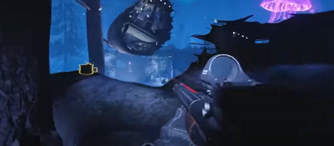

# Die Maschine Main Quest Guide

## Recomended setup:
* Aether Shroud
* Hauer

## Note:
* Need D.I.E. Shockwave and all four variants

## Steps

### Step 1:
Activate pack-a-punch.

### Step 2:
Find three parts in the dark aether, only one part will be availible at a time. Check each spot until you find a part then go back over the locations again until you have all three parts.

#### Part locations:
On crashed plane engine:\
\
\
Under the concrete stairs in spawn:\
\
\
On the staircase in the particle accelerator room:\
\
\
\
Once all parts have been collected, build it on the workbench right below the pack-a-punch and pick it up.

### Step 3:
Go into the medbay and use the anomaly.\
\
\
\
Grab the diary on the desk in the viewing area:\
\
\
\
In that room there will be a blue orb, interact with it and give the ghost the diary.\
\
\
\
Go into the trials room and find a blude orb and do the same thing. Go below pack-a-punch right in front of the workbench to find the last blue orb. Once done go to the desk with the diary and interact with the computer to enter the password.

### Step 4:
At this point you need all four variants of the D.I.E. Shockwave. Shoot each corner of the central hanging cannister in the medbay. Each corner has a color that needs to be shot by the matching variant.\
\
\
\
Each corner will move up when done correctly.

### Step 5:

Take the anomaly just outside of the medbay towards the particle accelerator. Go infront of this red box just outside the viewing area.\
\
\
\
Interact with the ghosts there and then pick up the wrench.

### Step 6:
Interact with the tank in spawn, kill the zombie that pops out. Throw an explosive on top of the tank to get it to fire.

### Step 7:
Go to the crashsite and pick up the golden ball on the ground and bring it to the box just outside the viewing area.

### Step 8:
Bring two halves of a megaton under the central hanging cannister in the medbay. Each one will get sucked up into it. When both are in the cannister have the whole team go into the viewing area in the medbay and interact with the computer.

### Step 9:
Get completley set up.

### Step 10:
Interact with the anomaly in Nacht Der Untoten. Find a bllue orb and interact with it. A picture will drop where he was. Interact with the picture to go into the semi bossfight.

### Step 11:
In the particle accelerator room protect Orlov while he does some thing, it will last a little while. Orlov stops what he is doing when attacked, he cannot be killed.

### Step 12:
When Orlov is done you will want an Aether Shroud charge to escape. Run to the exfil location. A timer will be on and the bolts of blue energy will kill you. Only one person needs to make it to the exfil to make it out.

### Step 13:
gg come on treyarch give us a challenge
